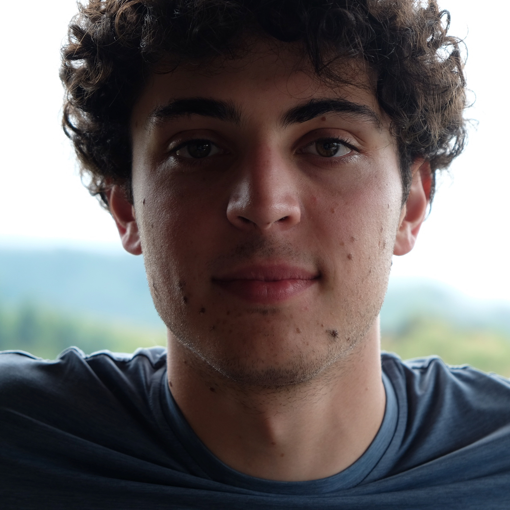

  
  

    <h1 class="title">Jacopo Senoner</h1>
    

      <a href="https://github.com/renonesopocaj" target="_blank" rel="noopener" style="display:inline-flex;align-items:center;gap:0.5rem;text-decoration:none;color:var(--color-accent-2);">
        <svg stroke="currentColor" fill="currentColor" stroke-width="0" viewBox="0 0 24 24" aria-hidden="true" style="width:20px;height:20px;opacity:0.9;" xmlns="http://www.w3.org/2000/svg"><path fill-rule="evenodd" clip-rule="evenodd" d="M12.026 2c-5.509 0-9.974 4.465-9.974 9.974 0 4.406 2.857 8.145 6.821 9.465.499.09.679-.217.679-.481 0-.237-.008-.865-.011-1.696-2.775.602-3.361-1.338-3.361-1.338-.452-1.152-1.107-1.459-1.107-1.459-.905-.619.069-.605.069-.605 1.002.07 1.527 1.028 1.527 1.028.89 1.524 2.336 1.084 2.902.829.091-.645.351-1.085.635-1.334-2.214-.251-4.542-1.107-4.542-4.93 0-1.087.389-1.979 1.024-2.675-.101-.253-.446-1.268.099-2.64 0 0 .837-.269 2.742 1.021a9.582 9.582 0 0 1 2.496-.336 9.554 9.554 0 0 1 2.496.336c1.906-1.291 2.742-1.021 2.742-1.021.545 1.372.203 2.387.099 2.64.64.696 1.024 1.587 1.024 2.675 0 3.833-2.33 4.675-4.552 4.922.355.308.675.916.675 1.846 0 1.334-.012 2.41-.012 2.737 0 .267.178.577.687.479C19.146 20.115 22 16.379 22 11.974 22 6.465 17.535 2 12.026 2z"></path></svg>
        GitHub
      </a>
      <a href="https://www.linkedin.com/in/jacoposenoner/" target="_blank" rel="noopener" style="display:inline-flex;align-items:center;gap:0.5rem;text-decoration:none;color:var(--color-accent-2);">
        <svg stroke="currentColor" fill="currentColor" stroke-width="0" viewBox="0 0 24 24" aria-hidden="true" style="width:20px;height:20px;opacity:0.9;" xmlns="http://www.w3.org/2000/svg"><path d="M20 3H4a1 1 0 0 0-1 1v16a1 1 0 0 0 1 1h16a1 1 0 0 0 1-1V4a1 1 0 0 0-1-1zM8.339 18.337H5.667v-8.59h2.672v8.59zM7.003 8.574a1.548 1.548 0 1 1 0-3.096 1.548 1.548 0 0 1 0 3.096zm11.335 9.763h-2.669V14.16c0-.996-.018-2.277-1.388-2.277-1.39 0-1.601 1.086-1.601 2.207v4.248h-2.667v-8.59h2.56v1.174h.037c.355-.675 1.227-1.387 2.524-1.387 2.704 0 3.203 1.778 3.203 4.092v4.71z"></path></svg>
        LinkedIn
      </a>
    

  

## About

I'm a second-year MSc Computer Science student at EPFL interested in machine learning/AI and
scientific computing.
I earned my Bachelor's degree in Computer Engineering from Politecnico di Milano.

#### Current work

- **Numerical Analysis for the $p$-Stokes problem**: I am currently studying the $p$-Stokes problem,
under supervision of Prof. M. Botti at [MOX Lab, PoliMi](https://mox.polimi.it/). This work was presented at [SIAM Chapters
Meeting, PoliMi](https://polimi-siam-studentchapter.github.io/home/). A preprint will soon be available.

#### Research experience

- **Physics-Informed ML, Graph Neural Networks (GNNs), and Inductive Biases**: I studied inductive biases in GNNs for 
learning the solution operator of a PDE with applications in structural mechanics. 
Work conducted at [IMOS Lab, EPFL](https://www.epfl.ch/labs/imos/), yet not publicly available.

#### Selected academic projects

- [Markov Chain Monte Carlo](https://github.com/renonesopocaj/3d-queens-mcmc) for the $N^2$-queens problem.
- [Bandit algorithms for neighbour sampling in decentralized learning](https://github.com/renonesopocaj/bandit-decentralized-learning): studied multi-armed bandit algorithms for 
adaptive neighbour sampling in decentralized learning. Focused on their ability to recover latent client clusters under 
data heterogeneity. Evaluated on FEMNIST (Federated MNIST) classification.
- **Adversarial Attacks Against LLM Routers**, not publicly available yet.

#### Music

During my final years of high school and throughout my undergrad, I spent my free time learning to play the piano,
the drums, and to make music. Here’s my [Spotify artist profile](https://open.spotify.com/artist/6BF3u0mCZazib7Qt0V9SUQ?si=uzJEpe06Rg-hrR4Z60v6KQ). A few highlights:
- Worked as a composer under contract with Alieno Label, distributed by ADA Music Italy (Warner Music Group), 2021-2024.
- Performed live as a DJ at various clubs in Milan: Legend, Inside, Apophis, etc.
- Assisted with sound and lighting operations at [Milano Classica](https://www.milanoclassica.it/).
- I also spent some time composing at [FOMO Studios in London](https://www.fomo.london/clients), collaborating with established musicians and 
producers.