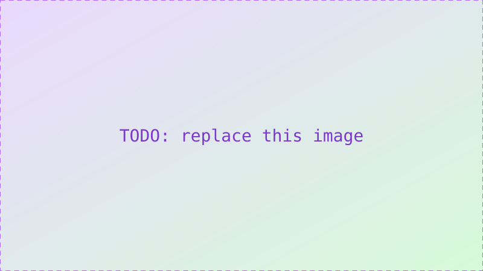

TODO: replace this with your first real post. It's kept here as a working example of the three things the blog supports beyond plain text: images, video, and math. Delete whichever sections you don't need.

## Images

Standard markdown image syntax works:



## Video

Drop a video file next to your post's assets and reference it with a raw HTML `<video>` tag (markdown here allows raw HTML passthrough):

<video controls poster="../../assets/placeholder.svg" style="width:100%;">
  <source src="TODO-add-your-video.mp4" type="video/mp4">
  Your browser doesn't support embedded video.
</video>

If you'd rather embed a hosted video (e.g. YouTube), wrap the iframe in `.embed-16x9` so it stays responsive:

<div class="embed-16x9">
  <iframe src="TODO-add-embed-url" title="TODO: video title" allowfullscreen></iframe>
</div>

## Math

Inline math uses single dollar signs, like $E = mc^2$ or $x_i$, and block math uses double dollar signs:

$$
\int_0^\infty e^{-x^2}\, dx = \frac{\sqrt{\pi}}{2}
$$

Multi-line math (e.g. `aligned`) works too, including backslash line breaks:

$$
\begin{aligned}
a &= b + c \\
c &= d - e
\end{aligned}
$$

## Code

Fenced code blocks are supported and syntax-highlight-ready:

```python
def hello() -> str:
    return "hello, blog"
```
